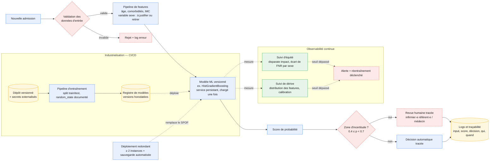

# Option A — ML classique modernisé (industrialisation du prédicteur existant)
 

 
## Légende de convention (à reprendre à l'identique pour les schémas B et C)
 
- **rectangle plein** = étape de traitement
- **losange** = point de décision
- **cylindre** = stockage de données
- **trait plein** = flux principal
- **trait pointillé** = chemin de fallback, supervision ou monitoring
- **couleur bleue** = traitement métier
- **couleur jaune** = stockage
- **couleur rouge** = décision / fallback
- **couleur verte** = observabilité / monitoring
> À valider en binôme : si vous adoptez cette légende pour B et C, les 3 schémas seront directement comparables (exigence du livrable 2 : « mêmes formes et couleurs, mêmes niveaux de détail »).
 
## Principe
 
Reprendre l'architecture ML existante (RandomForest ou équivalent scikit-learn), l'industrialiser (CI/CD, service persistant, logs, redondance, secrets externalisés) et combler les manques que l'audit M7-B1 a identifiés — sans introduire de brique LLM. Le texte des comptes-rendus n'est pas exploité dans cette option.
 
## Force
 
Coût et complexité minimaux ; explicabilité native (feature importance, SHAP possible) ; conformité facilitée par une traçabilité complète et l'absence de traitement de données non structurées supplémentaires.