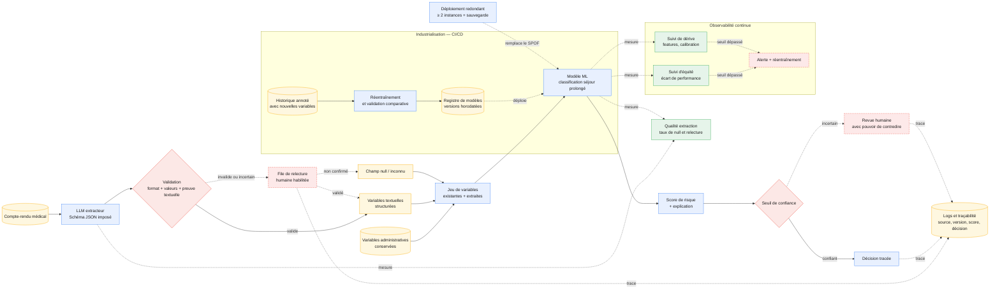

# Option B - Architecture hybride : extraction LLM puis modèle ML

**Principe** : le LLM n'effectue pas la prédiction. Il extrait, à partir des
 comptes-rendus, des variables structurées selon un schéma imposé. Ces variables
 sont validées puis ajoutées aux variables administratives avant l'inférence du
 modèle ML existant ou modernisé.

**Variables candidates** : autonomie à la sortie, complication mentionnée et
besoin de suivi après sortie. Chaque variable utilise une liste de valeurs
fermée et accepte `null` ou `inconnu` si l'information est absente ou non
confirmée par une phrase source.

**Validation et traçabilité** : la validation contrôle le format JSON, les types,
les valeurs autorisées et la présence d'une preuve textuelle. La version du
LLM, le compte-rendu source, la variable produite et le résultat de validation
sont conservés dans une trace d'audit. Les données de santé ne sont envoyées à
un fournisseur externe qu'après vérification du cadre RGPD, de la localisation
des traitements et des garanties contractuelles ; un modèle auto-hébergé peut
être étudié si cette contrainte est bloquante.

**Force** : l'architecture exploite une information textuelle absente du jeu de
données administratif tout en conservant un modèle ML mesurable, calibrable et
explicable pour la prédiction.

**Faiblesse** : elle ajoute le coût et la latence d'une extraction LLM, ainsi
qu'un risque d'erreur ou de valeur inventée. Le gain n'est pas présumé : il est
mesuré par ablation, avec le même modèle, le même jeu de test et les mêmes
métriques, avec puis sans les variables extraites.

**Fallback** : si l'extraction est invalide, incertaine ou sans preuve textuelle,
la variable devient `null` ou `inconnu` et le dossier est placé en relecture
par un professionnel habilité. La relecture doit pouvoir contredire le LLM,
être réalisée dans le délai défini par MediVox et laisser une trace. Si le score
ML est lui-même dans une zone d'incertitude, par exemple entre 0,40 et 0,70,
la prédiction s'abstient et est transmise à la revue humaine.

**RAG distinct** : un assistant RAG pourrait répondre aux questions des équipes
à partir des procédures ou des comptes-rendus, avec des sources citées. Ce
serait un produit documentaire séparé ; il ne remplace pas le pipeline
d'extraction puis de prédiction de cette option.