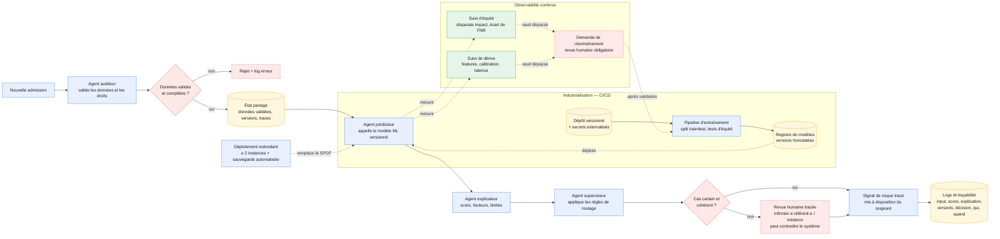

# Option C — Multi-agents pour supervision du prédicteur

**Principe** : des agents spécialisés coordonnent la validation, la prédiction,
l'explication et le routage. Le modèle ML versionné reste responsable du score ;
le système fournit un signal au soignant, pas une décision médicale autonome.

**Force** : les responsabilités et le contexte partagé sont explicités ; les cas
incertains, incohérents ou dégradés sont orientés vers une décision humaine
traçable.

**Faiblesse** : orchestration, tests, observabilité et débogage plus complexes ;
un gain sur une prédiction tabulaire reste à démontrer face à l'option A.

**Fallback** : l'agent superviseur transmet à un professionnel habilité tout cas
incertain, incohérent ou en erreur. Celui-ci peut modifier ou annuler le signal,
dans un délai défini et avec une justification tracée. Une dérive ou un écart
d'équité déclenche une demande de réentraînement, jamais un redéploiement automatique.
