# Option C — Multi-agents pour supervision du prédicteur

```mermaid

flowchart LR
    classDef process fill:#e8f0fe,stroke:#4285f4,color:#1a1a1a
    classDef data fill:#fef7e0,stroke:#f9ab00,color:#1a1a1a
    classDef decision fill:#fce8e6,stroke:#ea4335,color:#1a1a1a
    classDef fallback fill:#fde9e9,stroke:#ea4335,stroke-dasharray: 4 3,color:#1a1a1a
    classDef monitor fill:#e6f4ea,stroke:#34a853,color:#1a1a1a
    classDef agent fill:#ffe8cc,stroke:#e67700,stroke-width:4px,color:#1a1a1a

    IN[Nouvelle admission]:::process --> AUDIT[<b>Agent</b> auditeur<br/>valide les données et les droits]:::agent
    AUDIT --> CHECK{Données valides<br/>et complètes ?}:::decision
    CHECK -->|non| ERRLOG[Rejet + log erreur]:::fallback
    CHECK -->|oui| STATE[(État partagé<br/>données validées, versions, traces)]:::data

    STATE --> PRED[<b>Agent</b> prédicteur<br/>appelle le modèle ML versionné]:::agent
    PRED --> EXPLAIN[<b>Agent</b> explicateur<br/>score, facteurs, limites]:::agent

    AUDIT --> SUP[<b>Agent</b> superviseur<br/>croise les résultats et route le dossier]:::agent
    PRED --> SUP
    EXPLAIN --> SUP

    SUP --> DEC{Cas certain et<br/>cohérent ?}:::decision
    DEC -->|oui| OUT[Signal de risque tracé<br/>mis à disposition du soignant]:::process
    DEC -->|non| HITL[Revue humaine tracée<br/>infirmier·e référent·e / médecin<br/>peut contredire le système]:::fallback
    HITL --> OUT
    OUT --> LOGS[(Logs et traçabilité<br/>input, score, explication,<br/>versions, décision, qui, quand)]:::data

    subgraph CICD["Industrialisation — CI/CD"]
        direction LR
        REPO[(Dépôt versionné<br/>+ secrets externalisés)]:::data --> TRAIN[Pipeline d'entraînement<br/>split train/test, tests d'équité]:::process
        TRAIN --> REG[(Registre de modèles<br/>versions horodatées)]:::data
        REG -.déploie.-> PRED
    end

    subgraph OBS["Observabilité et alerte"]
        direction LR
        PRED -.mesure.-> METRICS[(Métriques<br/>équité, dérive, calibration, latence)]:::data
        METRICS --> DASH[Tableau de bord<br/>MLOps + référent métier]:::monitor
        METRICS --> WATCH[<b>Agent</b> de surveillance<br/>détecte les seuils dépassés]:::agent
        WATCH --> ALERT{Alerte<br/>confirmée ?}:::decision
        ALERT -->|non| DASH
        ALERT -->|oui| REQUEST[Demande de réentraînement<br/>avec éléments de preuve]:::fallback
        REQUEST --> APPROVE[Validation humaine<br/>MLOps + référent métier]:::fallback
        APPROVE -->|autorisé| TRAIN
        APPROVE -->|refusé / à investiguer| DASH
    end

    INFRA[Déploiement redondant<br/>≥ 2 instances + sauvegarde automatisée]:::process -.remplace le SPOF.-> PRED
```

**Principe** : des agents spécialisés coordonnent la validation, la prédiction,
l'explication et le routage. Le modèle ML versionné reste responsable du score ;
le système fournit un signal au soignant, pas une décision médicale autonome.

**Descriptions des agents** : 

 Agent | Entrées | Fonction | Sorties | Intérêt : à quoi sert l’approche agentique ? | Risque / limite par rapport à l’option A |
|---|---|---|---|---|---|
| **Auditeur** | Données d’admission, règles de validation, droits d’accès | Vérifie présence, types, plages de valeurs, cohérence métier et autorisations | Données validées ou rejet avec motif ; statut de conformité | Peut consolider des règles nombreuses et contextualisées, puis fournir un motif lisible de rejet au professionnel. | Pour des règles stables, le validateur déterministe de A est plus simple, fiable et auditable. Un agent peut rejeter à tort ou interpréter une règle de manière imprévisible. |
| **Prédicteur** | Données validées, modèle ML versionné | Appelle le modèle ML et calcule la probabilité de séjour prolongé | Score, niveau de confiance, version du modèle | Très faible : un agent n’apporte rien s’il se limite à appeler le même modèle ML que A. | Ajoute une couche d’orchestration, de latence et de panne sans améliorer le score. Les biais, erreurs de labellisation et limites du modèle restent identiques à A. |
| **Explicateur** | Score, variables effectivement utilisées, méthode d’explication contrôlée, version du modèle | Prépare une explication contrôlée pour le professionnel | Facteurs principaux, limites, explication traçable | Peut adapter la présentation de l’explication au contexte du dossier et aux besoins du soignant, tout en indiquant les limites. | A peut déjà produire des explications déterministes, par exemple avec SHAP. Un agent risque d’inventer une justification ou de donner une impression de certitude excessive. |
| **Superviseur** | Statut de validation, score/confiance, explication, règles de routage | Décide du chemin : signal disponible, rejet ou revue humaine | Décision de routage et motif associé | Peut arbitrer plusieurs signaux hétérogènes et des politiques de routage évolutives, en documentant le motif de l’escalade. | Avec quelques seuils stables, le moteur de règles de A est plus sobre et prévisible. Des règles agentiques mal calibrées peuvent automatiser un cas incertain ou surcharger la revue humaine. |
| **Surveillance** | Métriques de qualité, équité, dérive, erreurs et latence | Croise les seuils et le contexte, puis ouvre une alerte documentée | Alerte ou demande de réentraînement avec preuves | Peut relier plusieurs alertes, résumer le contexte et préparer un diagnostic pour l’équipe MLOps avant décision humaine. | Le monitoring à seuils de A suffit pour les signaux connus. L’agent ajoute coût et complexité, peut créer de fausses alertes ou déclencher des demandes de réentraînement inutiles. |

**Arbitrage métier : pertinence et limites de l’approche agentique**

| Agent | Intérêt de passer par un agent | Risques / limites par rapport à l’option A |
|---|---|---|
| **Auditeur** | **Déconseillé** : les règles de validation sont normalement fixes et vérifiables ; un validateur déterministe suffit. | Interprétation imprévisible d’une règle, rejet injustifié, coût et latence ajoutés. |
| **Prédicteur** | **Déconseillé** : appeler le même modèle ML versionné ne devient pas plus performant parce qu’un agent l’appelle. | Complexité et point de panne supplémentaires, sans gain de performance ni de conformité. |
| **Explicateur** | **Modéré** : utile pour adapter la restitution des facteurs et limites au soignant. Le calcul des facteurs reste déterministe, par exemple via SHAP. | Risque d’explication inventée ou de confiance excessive ; A peut déjà fournir des facteurs déterministes. |
| **Superviseur** | **Faible** : pertinent seulement si les règles de routage deviennent nombreuses, contextuelles et souvent modifiées. | Avec un seuil stable, un moteur de règles de A est plus prévisible, sobre et simple à auditer. |
| **Surveillance** | **Faible** : un agent peut croiser plusieurs alertes et préparer un diagnostic MLOps. | Des seuils de monitoring connus sont mieux traités par les alertes classiques de A ; faux diagnostics possibles. |
| **Orchestration globale** | **Déconseillé** pour le besoin actuel : le processus est essentiellement séquentiel et tabulaire. | Plus d’appels, de latence, de coûts, de données à protéger et de scénarios de panne ; diagnostic plus difficile. |

**Fallback : Continuité de service et procédures de repli** : 

| Composant | Événement | Réponse de repli | Décision / traçabilité |
|---|---|---|---|
| **Agent auditeur** | Données absentes, invalides ou agent indisponible | Rejet du dossier et demande de correction au SI source ; aucune prédiction automatique | Motif, identifiant de dossier pseudonymisé et horodatage journalisés |
| **Agent prédicteur / modèle ML** | Service, registre ou instance indisponible | Bascule vers une instance redondante ; en cas d’échec, file de revue humaine sans score | Indisponibilité, version attendue et action humaine tracées |
| **Agent explicateur** | Explication indisponible, incohérente ou non ancrée dans les variables du modèle | Ne pas générer de justification libre ; afficher le score comme « explication indisponible », puis revue humaine si le signal est utilisé | Score, état de l’explication et décision du professionnel enregistrés |
| **Agent superviseur** | Règles contradictoires, agent indisponible ou confiance insuffisante | Désactivation du routage automatique ; transmission systématique à la revue humaine | Cause du basculement, délai de traitement et décision finale tracés |
| **Agent de surveillance** | Agent ou collecte de métriques indisponible | Les métriques déjà collectées restent visibles ; alerte d’exploitation ; contrôle manuel temporaire par l’équipe MLOps | Incident, période sans surveillance automatisée et action de rétablissement tracés |
| **Infrastructure** | Panne d’instance ou perte d’accès à un service | Bascule vers une seconde instance et restauration depuis sauvegarde ; sinon mode dégradé avec revue humaine | Journal d’incident, temps d’indisponibilité et reprise tracés |
